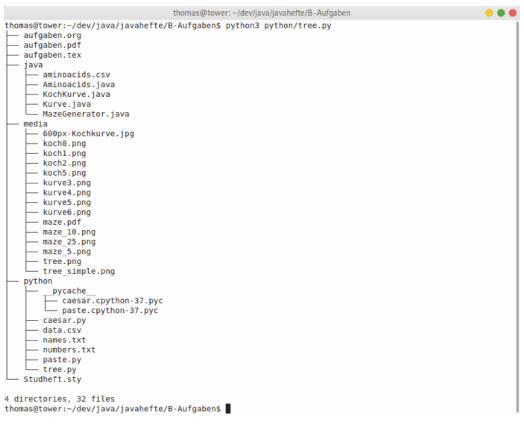
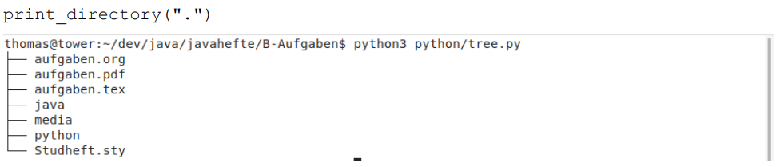

# Aufgabe 1: Tree (Python)

Einsendeaufgabencode: B-GOPB01-XX2-K04  
Bearbeiter: Maxim Heibach  
Matrikelnummer: 909442

## Aufgabe

Das Tool „tree“ stellt den Inhalt des aktuellen Verzeichnisses in einer baumartigen Struktur dar. Falls „tree“ auf ein Unterverzeichnis stößt, werden die Dateinamen in diesem Verzeichnis eingerückt ausgegeben. Dies setzt sich für Unter-Unterverzeichnisse usw. rekursiv fort. Ein Beispiel für die Ausgabe von „tree“ mit einem Verzeichnis mit drei Unterverzeichnissen und einem Unter-Unterverzeichnis zeigt:

1. Implementieren Sie eine Funktion `print_directory(path)`. Diese Funktion soll mittels `os.scandir` über die Dateien im übergebenen Verzeichnis iterieren und die Dateinamen wie in der Abbildung gezeigt ausgeben. Im Hauptprogramm rufen Sie `print_directory` mit dem aktuellen Verzeichnis auf: 

    

    Sie benötigen die Unicode-Symbole mit der Dezimaldarstellung 9472, 9474, 9492 und 9500.
Den waagerechten Strich erhalten Sie bspw. über `chr(9472)`. Beachten Sie die Ausgabe der letzten Datei im Verzeichnis!   

    Hinweise: Damit Sie die Dateien nach ihren Namen sortiert ausgeben können, übergeben Sie die Rückgabe von `os.scandir` an die Funktion *sorted*. Dem benannten Parameter `key` der Funktion `sorted` weisen Sie die folgende Lambda-Funktion zu:
`lambda f: f.name.lower()`. 

2. Erweitern Sie die Funktion `print_directory` um einen zweiten Parameter für die Einrückungsebene:  
`print_directory(path, indentation_level=0)`  
Falls Sie auf ein Verzeichnis stoßen (verwenden Sie die `DirEntry`-Methode `is_dir`), rufen Sie `print_directory` rekursiv für dieses Verzeichnis und `indentation_level + 1` auf. Passen Sie die Ausgabe anhand der aktuellen Einrückungsebene `indentation_level` an.

3. Ergänzen Sie am Ende der Ausgabe die Zählung  
`X directories, Y files`  
Hinweis: Lassen Sie `print_directory` ein Tupel `(nfiles, ndirectories)` zurückliefern. 
